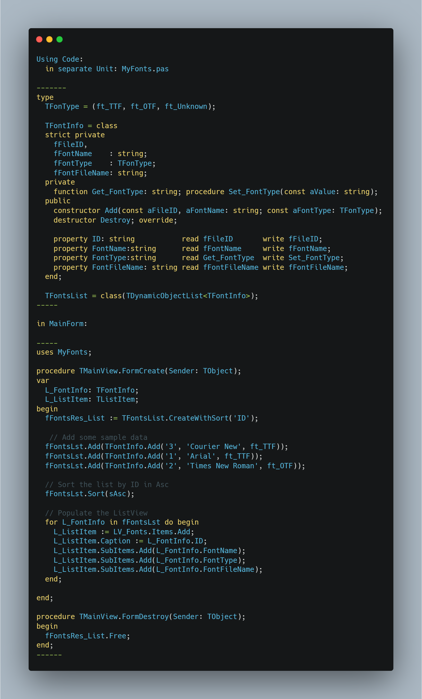

# TDynamicObjectList
TDynamicObjectList for dynamic Sort Objects, ---   currentlly it's works only with fields marked as string or integer but real value are in integer and sorted using : CompareNumbers

 

